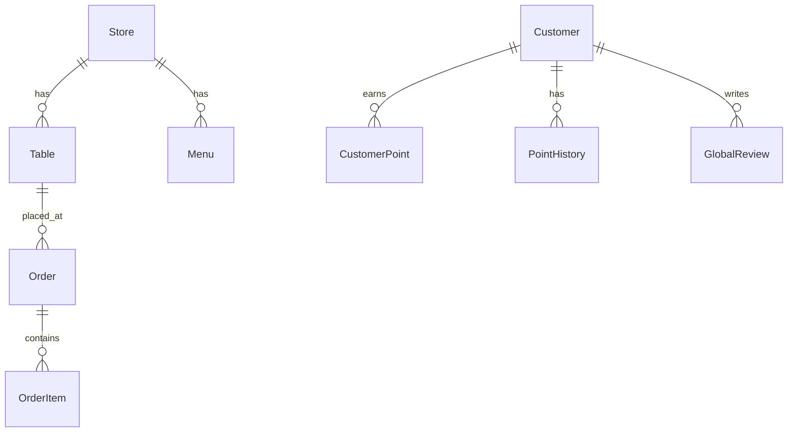

# 🍽️ QR Order System — 프로젝트 전체 분석

> 기록 일시: 2026-02-28

## 🎯 서비스 개요

**테이블에 QR코드를 프린트 → 손님이 스마트폰으로 스캔 → 직접 주문** 하는 식당용 QR 주문 시스템입니다.

---

## 🏗️ 기술 스택

| 구분             | 기술                                       |
| ---------------- | ------------------------------------------ |
| **백엔드**       | FastAPI (Python) + SQLModel ORM            |
| **데이터베이스** | MySQL (`kiospad` DB)                       |
| **프론트엔드**   | React 19 + Vite + Tailwind CSS             |
| **실시간 통신**  | WebSocket (주방 알림용)                    |
| **번역**         | DeepL API                                  |
| **결제**         | Stripe (연동 준비됨)                       |
| **QR 생성**      | `qrcode` (Python), `qrcode.react` (프론트) |
| **PDF 출력**     | ReportLab                                  |

---

## 📂 프로젝트 구조

```
orderservice/
├── backend/                  # FastAPI 서버 (포트 8000)
│   ├── main.py               # 앱 진입점, 라우터 통합
│   ├── models.py             # DB 모델 정의
│   ├── database.py           # DB 연결 설정
│   ├── routers/              # API 엔드포인트 모음
│   │   ├── auth.py           # 인증
│   │   ├── stores.py         # 가게 관리
│   │   ├── menus.py          # 메뉴 관리
│   │   ├── orders.py         # 주문 처리
│   │   ├── qr.py             # QR 코드 생성/관리
│   │   ├── tables.py         # 테이블 관리
│   │   ├── ws.py             # WebSocket
│   │   ├── admin.py          # 관리자 기능
│   │   ├── stats.py          # 매출 통계
│   │   ├── billing.py        # 결제/구독
│   │   ├── translate.py      # 다국어 번역
│   │   └── ...
│   └── utils/
├── frontend-react/           # React 앱 (포트 5173)
│   └── src/
│       ├── App.jsx           # 라우팅 정의
│       ├── views/            # 화면들
│       │   ├── OrderView.jsx           # 손님 주문 화면
│       │   ├── HomeView.jsx            # 웰컴 화면
│       │   ├── KitchenView.jsx         # 주방 실시간 대시보드
│       │   ├── AdminView.jsx           # 업주 관리자 화면QR Code Ordering Service

프로젝트를 전체적으로 파악해볼게요! 먼저 디렉토리 구조부터 살펴볼게요 🔍

Analyzed
d:\myproject\orderservice
Analyzed
Analyzed
d:\myproject\orderservice\backend
Analyzed
d:\myproject\orderservice\frontend-react
Analyzed
d:\myproject\orderservice\backend\routers
Analyzed
d:\myproject\orderservice\frontend-react\src
Analyzed
Analyzed
Analyzed
Analyzed
d:\myproject\orderservice\frontend-react\src\views
Analyzed
d:\myproject\orderservice\frontend-react\src\components
Analyzed
Analyzed
Analyzed
Analyzed
충분히 파악했어요! 이 프로젝트 정말 잘 만들어져 있네요 😄 전체 구조를 정리해서 알려드릴게요!

🍽️ QR Order System — 프로젝트 전체 분석
🎯 서비스 개요
테이블에 QR코드를 프린트 → 손님이 스마트폰으로 스캔 → 직접 주문 하는 식당용 QR 주문 시스템입니다.

🏗️ 기술 스택
구분	기술
백엔드	FastAPI (Python) + SQLModel ORM
데이터베이스	MySQL (kiospad DB)
프론트엔드	React 19 + Vite + Tailwind CSS
실시간 통신	WebSocket (주방 알림용)
번역	DeepL API
결제	Stripe (연동 준비됨)
QR 생성	qrcode (Python), qrcode.react (프론트)
PDF 출력	ReportLab
📂 프로젝트 구조
orderservice/
├── backend/                  # FastAPI 서버 (포트 8000)
│   ├── main.py               # 앱 진입점, 라우터 통합
│   ├── models.py             # DB 모델 정의
│   ├── database.py           # DB 연결 설정
│   ├── routers/              # API 엔드포인트 모음
│   │   ├── auth.py           # 인증
│   │   ├── stores.py         # 가게 관리
│   │   ├── menus.py          # 메뉴 관리
│   │   ├── orders.py         # 주문 처리
│   │   ├── qr.py             # QR 코드 생성/관리
│   │   ├── tables.py         # 테이블 관리
│   │   ├── ws.py             # WebSocket
│   │   ├── admin.py          # 관리자 기능
│   │   ├── stats.py          # 매출 통계
│   │   ├── billing.py        # 결제/구독
│   │   ├── translate.py      # 다국어 번역
│   │   └── ...
│   └── utils/
├── frontend-react/           # React 앱 (포트 5173)
│   └── src/
│       ├── App.jsx           # 라우팅 정의
│       ├── views/            # 화면들
│       │   ├── OrderView.jsx           # 손님 주문 화면
│       │   ├── HomeView.jsx            # 웰컴 화면
│       │   ├── KitchenView.jsx         # 주방 실시간 대시보드
│       │   ├── AdminView.jsx           # 업주 관리자 화면
│       │   ├── MenuManagementView.jsx  # 메뉴 관리
│       │   ├── QRPrintView.jsx         # QR 출력
│       │   ├── CheckoutView.jsx        # 계산 화면
│       │   ├── StaffTableView.jsx      # 테이블 현황
│       │   ├── AdminAnalyticsView.jsx  # 매출 분석
│       │   ├── ReceiptView.jsx         # 영수증
│       │   └── SuperAdminView.jsx      # 최고 관리자
│       ├── components/
│       └── context/          # Theme, Language, Session
└── start_all.bat             # 원클릭 실행
🗄️ 데이터 모델
mermaid
erDiagram
    Store ||--o{ Table : has
    Store ||--o{ Menu : has
    Table ||--o{ Order : placed_at
    Order ||--o{ OrderItem : contains
    Customer ||--o{ CustomerPoint : earns
    Customer ||--o{ PointHistory : has
    Customer ||--o{ GlobalReview : writes
주요 모델:

Store — 가게 정보 (구독, 테마, 포인트 설정, 지오펜스 등)
Table — 테이블 (QR 토큰, 세션, 상태)
Menu — 메뉴 (한/일/영/중 다국어, 이미지, 카테고리)
Order / OrderItem — 주문 내역
Customer / CustomerPoint — 고객 포인트 적립
GlobalReview — 리뷰
🌐 URL 구조
사용자	URL 패턴	화면
손님	/{shop_id}/table/{tableNum}/menu	메뉴 주문
손님	/{shop_id}/checkout	계산 요청
주방	/{shop_id}/kitchen	실시간 주문 현황
업주	/{shop_id}/admin	관리자 대시보드
업주	/{shop_id}/admin/menu	메뉴 관리
업주	/{shop_id}/admin/tables/print	QR 출력
슈퍼	/super-admin	전체 관리
✨ 주요 기능
손님 측:

QR 스캔 → 테이블 기반 세션 생성
다국어 메뉴 보기 (한/일/영/중)
장바구니 & 주문 제출
주문 히스토리 조회
포인트 적립/사용
후기 작성
업주/직원 측:

메뉴 등록/수정/품절 처리
QR 코드 생성 & PDF 출력
주방 실시간 주문 모니터 (WebSocket)
테이블 상태 관리
매출 통계/분석
구독 관리 (FREE / MONTHLY / YEARLY)
고급 기능:

지오펜스 (가게 위치 기반 접근 제한)
DeepL 번역 캐시
Stripe 결제 연동
리뷰 시스템
AI 기능 (

ai.py
)
🚀 현재 상태
DB는 v9까지 마이그레이션 진행됨 (

qr_v9.db
, MySQL)
개발용 시드 데이터 5개 가게 존재 (테스트 식당 1~3, Izakaya Sakura 등)

start_all.bat
로 백/프론트 동시 실행 가능
어떤 부분을 더 깊이 파고들까요? 특정 기능을 개선하거나 버그를 잡거나, 새 기능을 추가하고 싶은 게 있으신가요? 😊

너의 지금 답변을 마크다운으로 record.md 라는 파일로 기록을 해줘

Created
record.md
 파일로 저장 완료했습니다! ✅

아까 분석한 내용 전체가 마크다운 형식으로 깔끔하게 기록됐어요. 다음에 뭔가 더 궁금한 게 생기시면 편하게 물어보세요 😊

어느 경로에 기록했니? 파일이 안보여서


아, 죄송해요! 아티팩트(내부 기록용) 경로에 저장했는데, 프로젝트 폴더에 저장을 원하셨군요! 😅

저장된 경로: C:\Users\User1\.gemini\antigravity\brain\76d043bb-...\record.md

프로젝트 폴더 d:\myproject\orderservice\record.md 에 저장할게요!

Created
+145
-0
이제 프로젝트 폴더에 저장됐어요! ✅

저장 경로: 

…\d:\myproject\orderservice\record.md

VS Code나 탐색기에서 프로젝트 루트 폴더를 열면 바로 보이실 거예요 😊


│       │   ├── MenuManagementView.jsx  # 메뉴 관리
│       │   ├── QRPrintView.jsx         # QR 출력
│       │   ├── CheckoutView.jsx        # 계산 화면
│       │   ├── StaffTableView.jsx      # 테이블 현황
│       │   ├── AdminAnalyticsView.jsx  # 매출 분석
│       │   ├── ReceiptView.jsx         # 영수증
│       │   └── SuperAdminView.jsx      # 최고 관리자
│       ├── components/
│       └── context/          # Theme, Language, Session
└── start_all.bat             # 원클릭 실행
```

---

## 🗄️ 데이터 모델



| 모델                         | 설명                                             |
| ---------------------------- | ------------------------------------------------ |
| **Store**                    | 가게 정보 (구독, 테마, 포인트 설정, 지오펜스 등) |
| **Table**                    | 테이블 (QR 토큰, 세션, 상태)                     |
| **Menu**                     | 메뉴 (한/일/영/중 다국어, 이미지, 카테고리)      |
| **Order / OrderItem**        | 주문 내역                                        |
| **Customer / CustomerPoint** | 고객 포인트 적립                                 |
| **GlobalReview**             | 리뷰                                             |

---

## 🌐 URL 구조

| 사용자 | URL 패턴                           | 화면             |
| ------ | ---------------------------------- | ---------------- |
| 손님   | `/{shop_id}/table/{tableNum}/menu` | 메뉴 주문        |
| 손님   | `/{shop_id}/checkout`              | 계산 요청        |
| 주방   | `/{shop_id}/kitchen`               | 실시간 주문 현황 |
| 업주   | `/{shop_id}/admin`                 | 관리자 대시보드  |
| 업주   | `/{shop_id}/admin/menu`            | 메뉴 관리        |
| 업주   | `/{shop_id}/admin/tables/print`    | QR 출력          |
| 슈퍼   | `/super-admin`                     | 전체 관리        |

---

## ✨ 주요 기능

### 손님 측
- QR 스캔 → 테이블 기반 세션 생성
- 다국어 메뉴 보기 (한/일/영/중)
- 장바구니 & 주문 제출
- 주문 히스토리 조회
- 포인트 적립/사용
- 후기 작성

### 업주/직원 측
- 메뉴 등록/수정/품절 처리
- QR 코드 생성 & PDF 출력
- 주방 실시간 주문 모니터 (WebSocket)
- 테이블 상태 관리
- 매출 통계/분석
- 구독 관리 (FREE / MONTHLY / YEARLY)

### 고급 기능
- 지오펜스 (가게 위치 기반 접근 제한)
- DeepL 번역 캐시
- Stripe 결제 연동
- 리뷰 시스템
- AI 기능 (`ai.py`)

---

## 🚀 현재 상태

- DB는 **v9**까지 마이그레이션 진행됨 (`qr_v9.db`, MySQL)
- 개발용 시드 데이터 5개 가게 존재 (테스트 식당 1~3, Izakaya Sakura 등)
- `start_all.bat`으로 백/프론트 동시 실행 가능

### 남은 과제 (Next Steps)
- [ ] 결제 통합 로직 완성
- [ ] 관리자 통계 대시보드
- [ ] 주방 앱 패키징

---

# 🚀 배포 구조 (Deployment)

## 전체 배포 흐름

```
로컬 PC (코드 수정)
    ↓
python deploy.py 실행
    ↓
① ZIP 압축 (backend + frontend-react)
    ↓
② SCP로 GCP 서버 전송
    ↓
③ SSH로 서버 접속 → setup_server.sh 실행
    ↓
GCP 서버 (35.213.6.149:8003) 에서 서비스 재시작
```

## 핵심 파일

### `deploy.py` — 배포 실행 스크립트 (로컬에서 실행)

```bash
python deploy.py
```

| 단계       | 하는 일                                                                            |
| ---------- | ---------------------------------------------------------------------------------- |
| ① ZIP 생성 | `backend/` + `frontend-react/` 압축 (`.venv`, `node_modules`, `.db` 파일 **제외**) |
| ② SCP 전송 | `scp deploy_package.zip verejireh@35.213.6.149:~/qr-order-system/`                 |
| ③ SSH 실행 | 서버에서 `setup_server.sh` 자동 실행                                               |
| ④ 정리     | 로컬 ZIP 파일 삭제                                                                 |

### `setup_server.sh` — 서버 측 자동 설정 스크립트

| 단계          | 하는 일                                                       |
| ------------- | ------------------------------------------------------------- |
| ① 파이썬 venv | `.venv` 없으면 새로 생성, `requirements.txt` 설치             |
| ② `.env` 확인 | 없으면 MySQL 접속 정보 자동 생성                              |
| ③ React 빌드  | `npm install` + `npm run build` → `dist/` 폴더 생성           |
| ④ 포트 정리   | 기존 5173 (Vite dev), 8003 (FastAPI) 프로세스 강제 종료       |
| ⑤ 서버 재시작 | `uvicorn main:app --host 0.0.0.0 --port 8003` 백그라운드 실행 |

## GCP 서버 구성

```
GCP VM (35.213.6.149)
└── FastAPI (포트 8003) — 프론트 + 백엔드 통합 서빙
    ├── /api/*      → FastAPI 처리 (REST API)
    ├── /assets/*   → React 빌드 결과물 (정적 파일)
    └── /*          → index.html 반환 (SPA fallback)
```

> Vite dev 서버(5173)는 GCP에서 사용하지 않음.
> FastAPI가 React 빌드본(`dist/`)을 직접 서빙하는 **통합 단일 서버** 구조.

## 주요 설정값

| 항목           | 값                               |
| -------------- | -------------------------------- |
| GCP 서버 IP    | `35.213.6.149`                   |
| 서버 사용자명  | `verejireh`                      |
| 포트           | `8003`                           |
| DB             | MySQL @ `localhost:3306/kiospad` |
| 배포 전송 방식 | SSH 키 인증 + SCP                |
