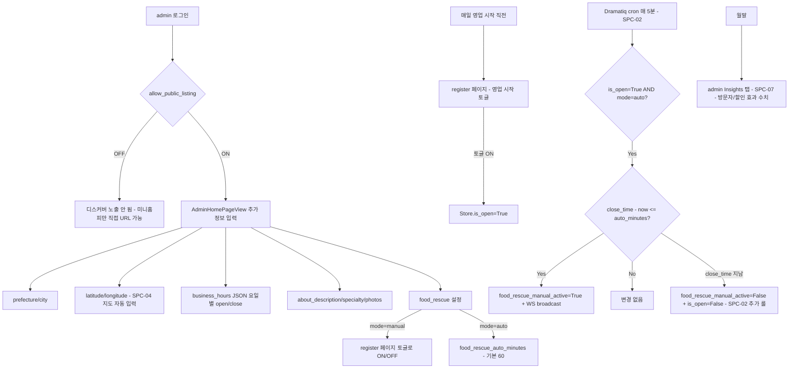

# SPC — qraku-specialize 기능 명세서 (SSoT)

> **작성**: 2026-05-20 (SPC-01)
> **상태**: 초안 v1 — §10 결정 대기 3 항목 자이라 검토 필요
> **목적**: SPC-02 ~ SPC-10 카드의 단일 진실 소스 (Single Source of Truth). 본 문서만 읽으면 후속 카드 착수 가능해야 함.

---

## §1. 사이클 목표 + 베치헤드

**한 줄**: 고텐바 50개 식당에서 손님이 **"10분 도보 + 마감 할인" 발견** 으로 5분 안에 결정 → 픽업까지 끝나는 경험.

| 항목 | 값 |
|---|---|
| 베치헤드 | 고텐바 시 (시즈오카, 88천명, 富士山 + アウトレット 관광 허브) |
| 타겟 식당 | 50개 (카페·베이커리·소규모 음식점) |
| 손님 USP | 위경도 발견 + 마감 할인 + 다국어 (ja/en/ko/zh) |
| 사장님 USP | POS 통합 + 미니홈피 + 자동 폐기 감소 + 데이터 인사이트 |
| 수익 모델 | `allow_public_listing=True` 사장님 월 ¥1,000 구독 할인 (데이터 인센티브) |
| 마케팅 SSoT | `D:\myproject\qraku-marketing\docs\strategy.md` (페르소나 A~D 정의) |

---

## §2. 코드 감사 결과 (2026-05-19)

| 영역 | 상태 | 핵심 파일 | 비고 |
|---|---|---|---|
| 미니홈피 (`/{shop_id}` → `StorePublicView.jsx`) | ✅ | `frontend-react/src/views/StorePublicView.jsx` (737 줄) | food rescue 배너 + 스탬프 + 포토리뷰 통합 |
| 사장님 공개 동의 UI | ✅ | `frontend-react/src/views/AdminHomePageView.jsx` | `Store.allow_public_listing` 토글 |
| 디스커버 (지역 필터) | ✅ | `backend/routers/discover.py` (251줄) + `DiscoverView.jsx` | `/public/discover/{menus,stores,filters}`, 정렬 4 종 |
| 마감 할인 데이터 모델 | ✅ | `Store.food_rescue_*` (5 필드 모두 존재) | 자동/수동 모드, auto_minutes (60) |
| **마감 할인 서버 자동화** | ⚠ 누락 | (없음) | StorePublicView 가 클라이언트 시계 비교만. **사장님 register 안 켜면 backend `food_rescue_manual_active` 안 켜짐 → discover 결과에서 누락** |
| **위경도 검색 API** | ⚠ 누락 | `Store.latitude/longitude` 컬럼만 존재, 인덱스/PostGIS 없음 | discover 가 지역명 (prefecture/city) 만 지원 |
| **지도 UI / 위치 권한** | ⚠ 누락 | DiscoverView 가 텍스트 검색만 | |
| SEO (JSON-LD/sitemap/hreflang) | ⚠ 누락 | StorePublicView 가 CSR — Google bot 약함 | |
| PWA (manifest/sw/push) | ⚠ 누락 | vite-plugin-pwa 없음 | |
| 알레르기 / 재고 / 인사이트 / referral | ⚠ 누락 | — | P2, 출시 후 |

**80% 이미 구현 / 남은 20% = USP 의 심장**. SPC-02 ~ SPC-04 가 P0.

---

## §3. 사용자 흐름 — 손님 (mermaid #1)

```mermaid
flowchart TD
    A1[Google Maps 검색] -->|매장명| B1[미니홈피 /shop_id]
    A2[QRaku 디스커버 진입] -->|위치 권한 OK| B2[지도 + 마커 view]
    A2 -->|위치 권한 거부| B3[지역명 텍스트 폴백 검색]
    A3[PWA 푸시 알림 - 단골 카페 할인 시작] -->|탭| B1

    B2 -->|마감 할인 마커 탭| C1[디스커버 카드 미리보기]
    B3 --> C1
    C1 -->|상세 보기| B1

    B1 -->|메뉴 보기| D1[/shop_id/menu]
    D1 -->|장바구니 + 선결제 테이크아웃| E1[Square/PayPay 결제]
    E1 -->|결제 완료| F1[/shop_id/receipt/order_id - 픽업 코드 표시]
    F1 -->|픽업 코드 제시| G1[현장 픽업 완료]

    B1 -->|단골 등록 PWA 푸시 옵트인| H1[Web Push 구독 - VAPID]
    F1 -->|포토 리뷰 콘테스트| I1[사진 업로드]
```

**핵심 분기점**:
- 진입 채널: Google Maps (SEO) / 디스커버 (위경도) / PWA 푸시 (재방문)
- 위치 거부 → 지역명 폴백 (앱 사용성 차단 X)
- 결제 → 픽업 코드 (Order.pickup_code, 모델 이미 존재)

---

## §4. 사용자 흐름 — 사장님 (mermaid #2)



**핵심 룰**:
- `is_open` (Store bool) = 사장님이 register 에서 매일 ON. SPC-02 cron 의 전제 조건.
- `food_rescue_mode='auto'` = backend 가 자동 활성화. `'manual'` = 사장님 수동만.
- `business_hours` JSON 파싱 필요 (open_at/close_at 컬럼 **없음** — §6 주의)

---

## §5. 기능 명세 표

| # | 기능 | 입력 | 출력 | 의존 모델 | 의존 API | 담당 카드 |
|---|---|---|---|---|---|---|
| F1 | 미니홈피 (사장님 공개 페이지) | shop_id (URL) | StorePublicView 렌더 | Store, Menu, PhotoReview | `/api/store/{shop_id}` | ✅ 완성 |
| F2 | 사장님 공개 동의 토글 | admin, allow_public_listing | bool | Store | `PATCH /api/admin/store` | ✅ 완성 |
| F3 | 디스커버 (지역명 필터) | prefecture, city, category, sort | items[] | Store, Menu, Order | `GET /public/discover/menus` | ✅ 완성 |
| F4 | **디스커버 (위경도 반경 검색)** | lat, lng, radius_m, only_active, category | items[]+distance_m | Store(lat/lng/PostGIS) | **`GET /api/discover/nearby` 신규** | **SPC-03** |
| F5 | **마감 할인 자동 발동** | 매 5분 cron, `is_open + mode=auto + business_hours` | `food_rescue_manual_active` 갱신 + WS 브로드캐스트 | Store | (없음 — 내부 worker) | **SPC-02** |
| F6 | **거리순 카드 리스트 + 위치 권한 + 필터** (지도 SDK 없음) | Geolocation API, 카테고리/거리/할인중 필터 | 카드 리스트 + "📍 지도 보기" 외부 링크 + 미니홈피 Embed iframe | (frontend) | F4 의 응답 + `google_maps_url` 필드 | **SPC-04** |
| F7 | 미니홈피 SEO 강화 | shop_id | JSON-LD Restaurant schema + meta + sitemap.xml + hreflang | Store, Menu | `GET /sitemap.xml` (신규) | **SPC-05** |
| F8 | PWA 설치 + 푸시 알림 구독 | manifest, sw, VAPID, 단골 옵트인 토글 | 홈 화면 설치 + 푸시 수신 | (Push 구독 모델 신규 — SPC-06 정의) | `POST /api/push/subscribe` (신규) | **SPC-06** |
| F9 | 사장님 인사이트 대시보드 | admin | 방문자/시간대/할인 효과/동네 평균 차트 | Order, OrderItem (집계) | `GET /api/admin/insights/*` (신규) | **SPC-07** |
| F10 | 알레르기 정보 | Menu.allergens JSON, 디스커버 필터 | 아이콘 표시 + 필터링 | Menu (필드 신규) | F3/F4 응답 확장 | **SPC-08** (P2) |
| F11 | 실시간 재고 | Menu.stock_today_*, register 입력 | 남은 수량 + 자동 sold-out | Menu (필드 신규) | `PATCH /api/admin/menus/{id}/stock` (신규) | **SPC-09** (P2) |
| F12 | 친구 추천 referral | 사장님 코드 / 손님 UTM | 인센티브 자동 적용 | (Referral 모델 신규) | `POST /api/referrals/*` (신규) | **SPC-10** (P2) |
| F13 | 마감 할인 수동 토글 | register 페이지 UI | `food_rescue_manual_active` 직접 set | Store | `PATCH /api/admin/store/food_rescue` | ✅ 완성 (mode=manual) |
| F14 | Web Push 발송 (단골 카페 할인 시작) | F5 의 자동 발동 이벤트 → 구독자 fan-out | 모바일 알림 | (Push 구독 모델 — F8) | 내부 worker (Dramatiq) | **SPC-06** 종속 |
| F15 | 디스커버 인증 무 (익명 허용 + IP rate-limit) | 클라이언트 IP | 200 / 429 | (rate-limit 미들웨어) | F3/F4 공통 | **SPC-03** (확정) |
| F16 | 기존 SettingView 에 매장 ON/OFF + 마감 할인 수동 토글 **별도 버튼** 추가 (register/staff/kitchen 공통 진입은 기존 사이드바 활용) | 직원 마스터 PIN | is_open 토글 (항상 활성) + food_rescue_manual_active 토글 (mode=manual 일 때만 활성) | Store | (기존 stores.py:340/360 재사용) | **SPC-11** (신규) |

총 16 행. **P0 = F4, F5, F6, F16** (SPC-02 ~ SPC-04, SPC-11). 출시 MVP = F1 ~ F8 + F16.

---

## §6. 데이터 모델 변경

**확인 결과: Store 모델은 거의 변경 불필요**. 카드 정의가 가정한 일부 컬럼명이 실제와 다름 — 후속 카드는 아래 정확한 이름 사용.

### Store (현존 — 변경 없음)

| 필드 | 타입 | 비고 |
|---|---|---|
| `latitude`, `longitude` | float | ✅ 존재. PostGIS `location` 컬럼 (F4) 의 소스 |
| `allow_public_listing` | bool | ✅ |
| `prefecture`, `city` | str(100) | ✅ |
| `category` | StoreCategory enum | ✅ (restaurant/cafe/bar/other) |
| `business_hours` | str(2000) JSON | ✅ `{"mon":{"open":"11:00","close":"22:00"},...}` — **SPC-02 가 파싱 대상** |
| `is_open` | bool | ✅ 영업중 토글 (사장님 매일 ON) |
| `food_rescue_active` | bool | ✅ 글로벌 ON/OFF |
| `food_rescue_msg` | str(500) | ✅ |
| `food_rescue_mode` | str | ✅ `'auto'` \| `'manual'` |
| `food_rescue_auto_minutes` | int | ✅ 기본 60 |
| `food_rescue_manual_active` | bool | ✅ SPC-02 cron 이 set |
| `about_description`, `specialty`, `interior_photos`, `exterior_photos`, `nearby_attractions` | str/JSON | ✅ 미니홈피용 |

⚠ **주의**: 카드 SPC-02 원안 `open_at`/`close_at` 컬럼은 **없음**. `business_hours` JSON 파싱이 SPC-02 의 핵심 헬퍼 (e.g. `services/business_hours.py:get_close_time_today(store, now) -> datetime|None`).

### Store (SPC-03 신규)

```sql
-- PostGIS 활성화 (운영자 결정 필요 — Cloud SQL 콘솔 5분)
CREATE EXTENSION IF NOT EXISTS postgis;

-- 옵션 A: 별도 geography 컬럼 + trigger
ALTER TABLE store ADD COLUMN location geography(POINT,4326);
CREATE INDEX idx_store_location ON store USING gist(location);
-- + trigger: latitude/longitude UPDATE 시 location 자동 동기화

-- 옵션 B (폴백, PostGIS 거부 시): haversine SQL + 박스 prefilter
-- (50 식당 규모에서는 폴백도 < 100ms 충족 가능)
```

### Menu (SPC-08 / SPC-09 신규, P2)

```python
allergens: str = Field(default="[]", max_length=200)  # JSON: ["wheat","dairy",...] (SPC-08)
stock_today_total: Optional[int] = Field(default=None)  # SPC-09
stock_today_sold: int = Field(default=0)                # SPC-09
# is_sold_out_today 는 computed (stock_today_total - sold <= 0)
```

### OrderItem (변경 없음)

`status` ('pending|cooking_complete|pickup_ready|served'), `is_takeout_item` 그대로.

### 신규 테이블 (SPC-06, SPC-10)

| 테이블 | 카드 | 핵심 필드 |
|---|---|---|
| `PushSubscription` | SPC-06 | store_id, endpoint (unique), p256dh, auth, guest_uuid, created_at |
| `ReferralCode` | SPC-10 | owner_store_id, code (unique), uses, max_uses, expires_at |
| `ReferralClaim` | SPC-10 | code, claimer_id (store_id 또는 guest_uuid), reward_status |

### 마이그레이션 규칙 (CLAUDE.md 규칙 2)

`backend/database.py` 의 `migration_sqls` 끝에 날짜 + 카드 ID 주석으로 추가:

```python
# [2026-05-XX] SPC-08 Menu allergens
"ALTER TABLE menu ADD COLUMN allergens VARCHAR(200) DEFAULT '[]'",
# [2026-05-XX] SPC-09 Menu stock
"ALTER TABLE menu ADD COLUMN stock_today_total INTEGER NULL",
"ALTER TABLE menu ADD COLUMN stock_today_sold INTEGER DEFAULT 0",
```

PostGIS 와 신규 테이블은 `SQLModel.metadata.create_all` 또는 별도 SQL 실행.

---

## §7. API 추가 목록

각 카드별 신규 엔드포인트 명세 (요청/응답 스키마 포함).

### F4 — `GET /api/discover/nearby` (SPC-03)

```
Query:
  lat: float (required, -90~90)
  lng: float (required, -180~180)
  radius_m: int (default 800, max 5000)  # 10분 도보 = 800m
  only_active: bool (default true)        # food_rescue_manual_active OR is_open
  category: str? (cafe|restaurant|bar|other)
  limit: int (default 20, max 50)

Response:
{
  "items": [
    {
      "shop_id": "abc123",
      "store_id": 42,
      "name": "...",
      "category": "cafe",
      "distance_m": 312,
      "lat": 35.30,
      "lng": 138.93,
      "food_rescue_active": true,
      "food_rescue_msg": "마감 30분 전 30% 할인",
      "current_special_menu": { "menu_id": 7, "name_jp": "...", "special_price": 350 } | null,
      "photo_url": "https://...",
      "open_until": "21:30" | null,    # business_hours 파싱 결과 (오늘 close 시간)
      "is_open": true,
      "google_maps_url": "https://www.google.com/maps/?q=35.30,138.93"  # 외부 링크 (SDK 미사용, 0원)
    }
  ],
  "total": 12,
  "radius_m": 800,
  "center": {"lat": ..., "lng": ...}
}

성능 목표: < 100ms (식당 50개 기준).
인증: 익명 허용 + IP rate-limit (디폴트, §10-a 참조).
```

### F8 — `POST /api/push/subscribe` + `DELETE /api/push/unsubscribe` (SPC-06)

```
POST /api/push/subscribe
Body: { shop_id, endpoint, keys: {p256dh, auth}, guest_uuid? }
Response: { subscription_id }

DELETE /api/push/unsubscribe
Body: { endpoint }
```

### F7 — `GET /sitemap.xml` (SPC-05, backend/main.py)

`Store.allow_public_listing=True` 매장 4 언어 hreflang URLs 동적 생성. 캐시 1h.

### F9 — `GET /api/admin/insights/*` (SPC-07, P2)

4 엔드포인트 권장: `visitors`, `popular_menus`, `rescue_effect`, `neighborhood_avg`. 인증 `require_admin`.

### F10 — F3/F4 응답에 `allergens` 필드 추가 + 쿼리 필터 `exclude_allergens=wheat,dairy` (SPC-08, P2)

### F11 — `PATCH /api/admin/menus/{id}/stock` (SPC-09, P2)

```
Body: { stock_today_total: int }
```

### F12 — `POST /api/referrals/generate` + `POST /api/referrals/claim` (SPC-10, P2)

---

## §8. 할인 자동화 룰 (SPC-02 입력 정밀화)

**문제**: 사장님이 매 영업일 register 페이지를 안 열어도 자동으로 할인이 backend `food_rescue_manual_active=True` 로 켜져야 한다. 안 그러면 디스커버 (`/api/discover/*`, F4) 결과에 안 나옴.

**해결**: Dramatiq scheduled actor (cron `*/5 * * * *`) 가 매 5분 모든 매장 스캔.

### 알고리즘 (의사코드)

```python
@dramatiq.actor
def food_rescue_auto_tick():
    now = datetime.now(JST)  # Asia/Tokyo
    stores = session.exec(
        select(Store).where(
            Store.allow_public_listing == True,
            Store.is_open == True,
            Store.food_rescue_active == True,
            Store.food_rescue_mode == "auto",
            Store.business_hours.is_not(None),
        )
    )
    for store in stores:
        close_time = get_close_time_today(store, now)  # business_hours JSON 파싱
        if close_time is None:
            continue  # 오늘 휴무
        minutes_until_close = (close_time - now).total_seconds() / 60
        should_be_active = 0 < minutes_until_close <= store.food_rescue_auto_minutes
        if should_be_active != store.food_rescue_manual_active:
            store.food_rescue_manual_active = should_be_active
            session.commit()
            broadcast_ws(f"food_rescue:{store.id}", {"active": should_be_active})
        if minutes_until_close <= 0:
            # close 지남: rescue 만 끔. is_open 은 절대 건드리지 않음 (§10-d 자이라 확정).
            if store.food_rescue_manual_active:
                store.food_rescue_manual_active = False
                session.commit()
                broadcast_ws(f"food_rescue:{store.id}", {"active": False})
```

### 영업시간 파싱 헬퍼 (기존 파일 확장)

⚠ **주의**: `backend/utils/business_hours.py` **이미 존재**. 단, 현재 `business_hours` JSON 무시하고 `is_open` 만 보고 있음 (`is_store_open_now()`). SPC-02 는 이 파일에 `get_close_time_today()` 만 **추가**한다 (새 파일 생성 X).

```python
# backend/utils/business_hours.py (기존 파일에 추가)
def get_close_time_today(store, now: datetime) -> Optional[datetime]:
    """business_hours JSON 에서 오늘 요일의 close 시간을 datetime 으로 변환.
    {"mon":{"open":"11:00","close":"22:00"}, "tue":{...}, ...}
    휴무일 또는 파싱 실패 시 None.
    JST (Asia/Tokyo) 기준."""
    ...
```

기존 `is_store_open_now()` 는 변경하지 않음 (의도적으로 is_open 만 보는 정책). SPC-02 cron 만 `get_close_time_today()` 새로 사용.

### 수용 기준

- Dramatiq actor `food_rescue_auto_tick` 등록 + cron `*/5 * * * *`
- `business_hours.py:get_close_time_today` + 단위 테스트 5 케이스 (요일 경계, 자정 넘김, 휴무일, 잘못된 JSON, 타임존)
- WS broadcast 채널 신규 `food_rescue:{store_id}` — StorePublicView / DiscoverView 가 구독 (Phase C 통합)
- 변경 시에만 commit + broadcast (idempotent)

---

## §9. 위경도 검색 룰 (SPC-03 입력 정밀화)

### 권장 경로: PostGIS

```sql
CREATE EXTENSION IF NOT EXISTS postgis;
ALTER TABLE store ADD COLUMN location geography(POINT,4326);
UPDATE store SET location = ST_SetSRID(ST_MakePoint(longitude, latitude),4326)
  WHERE latitude IS NOT NULL AND longitude IS NOT NULL;
CREATE INDEX idx_store_location ON store USING gist(location);

-- trigger: latitude/longitude UPDATE 시 location 자동 동기화
CREATE OR REPLACE FUNCTION sync_store_location() RETURNS trigger AS $$
BEGIN
  IF NEW.latitude IS NOT NULL AND NEW.longitude IS NOT NULL THEN
    NEW.location = ST_SetSRID(ST_MakePoint(NEW.longitude, NEW.latitude),4326);
  END IF;
  RETURN NEW;
END; $$ LANGUAGE plpgsql;
CREATE TRIGGER trg_sync_store_location BEFORE INSERT OR UPDATE OF latitude, longitude
  ON store FOR EACH ROW EXECUTE FUNCTION sync_store_location();

-- 쿼리:
SELECT id, name, ST_Distance(location, ST_MakePoint(:lng,:lat)::geography) AS distance_m
  FROM store
  WHERE allow_public_listing = TRUE
    AND ST_DWithin(location, ST_MakePoint(:lng,:lat)::geography, :radius_m)
  ORDER BY distance_m ASC
  LIMIT 20;
```

### 폴백 경로: Haversine + 박스 prefilter

PostGIS 활성화 거부 시 (운영자 결정):

```sql
-- 박스 prefilter (인덱스 활용)
WITH box AS (
  SELECT :lat - (:radius_m / 111000.0) AS lat_min,
         :lat + (:radius_m / 111000.0) AS lat_max,
         :lng - (:radius_m / (111000.0 * cos(radians(:lat)))) AS lng_min,
         :lng + (:radius_m / (111000.0 * cos(radians(:lat)))) AS lng_max
)
SELECT id, name,
  2 * 6371000 * asin(sqrt(
    power(sin(radians(latitude - :lat)/2),2) +
    cos(radians(:lat)) * cos(radians(latitude)) *
    power(sin(radians(longitude - :lng)/2),2)
  )) AS distance_m
FROM store, box
WHERE allow_public_listing = TRUE
  AND latitude BETWEEN box.lat_min AND box.lat_max
  AND longitude BETWEEN box.lng_min AND box.lng_max
HAVING distance_m <= :radius_m
ORDER BY distance_m ASC LIMIT 20;
```

### 추가 요구사항

- `Store.latitude/longitude` 단순 인덱스도 함께 추가 (폴백 박스 prefilter 가속)
- 응답 시간 < 100ms (식당 50개)
- 거리 오름차순, max 20
- `only_active=true` 시 `food_rescue_manual_active=True OR is_open=True` (둘 다 가능)
- 운영자 사전 결정 필요: **PostGIS 활성화 여부** (Cloud SQL 콘솔 → postgre-sql → flags → `cloudsql.enable_extensions` 확인)

---

## §10. 결정 사항 (자이라 검토 완료 2026-05-20)

### (a) Discover 인증 방식 — ✅ **확정: 익명 허용 + IP rate-limit**

손님이 로그인 없이 디스커버 사용 가능. SPC-03 에서 IP rate-limit 미들웨어 추가.

### (b) 알레르기 정보 (SPC-08) 우선순위 — ✅ **확정: P2 유지** (자이라 초기 답변 그대로)

출시 후 사용자 피드백 모니터링 후 P1 승격 검토.

### (c) PWA 푸시 알림 권한 UX (SPC-06) — ✅ **확정: 옵트인 토글 ("단골 등록" 버튼)**

미니홈피 우측 상단 "🔔 단골 등록" 버튼 → 클릭 시 권한 prompt + 구독.

### (d) 자동/수동의 정확한 의미 + UI 위치 룰 — ✅ **확정 (자이라 명확화 2026-05-20)**

> **핵심**: `food_rescue_mode` 의 자동/수동은 **마감 할인 이벤트 발동 방식**만을 의미한다. 매장 영업 자체의 시작/종료와는 별개.

| 항목 | 의미 | 누가 설정 | 어디서 |
|---|---|---|---|
| `food_rescue_mode = 'auto'` | 마감 N분 전 시간 도달 시 backend cron 이 자동으로 `food_rescue_manual_active=True` set | 사장님 (1회 설정) | **admin 페이지** (설정류) |
| `food_rescue_mode = 'manual'` | 직원이 직접 register/staff/kitchen 공통 setting 에서 ON/OFF | 직원 (매번) | **공통 staff setting 페이지 신규** |
| `Store.is_open` | 오늘 매장 영업 시작/종료 토글 (테이크아웃·테이블 주문 받는 상태) | 직원 (매일) | **공통 staff setting 페이지 신규** (현재 RegisterView 에 있음 → 이동) |
| `business_hours` JSON | 요일별 영업 시간 (자동 마감 할인의 기준 시각) | 사장님 (1회 설정) | **admin 페이지** (설정류) |
| `food_rescue_manual_active` | 마감 할인 이벤트 ON 상태 (자동 모드는 cron 이, 수동 모드는 직원이 set) | cron 또는 직원 | (auto) backend / (manual) 공통 staff setting |

**UI 위치 룰**:
- **admin** = 설정 (자동/수동 선택, 영업시간 JSON, 영업종료 N분 전 값, food_rescue_active 글로벌 ON/OFF, food_rescue_msg)
- **기존 SettingView (`/{shop_id}/setting`, 마스터 PIN 보유자용, register/staff/kitchen 공통 진입)** = 매일 운영
  - 두 토글은 **물리적으로 분리된 별개 버튼** (한 위젯에 묶지 X — 자이라 강조 2026-05-20)
  - 매장 ON/OFF 버튼 = `is_open` 토글 (별도 영역)
  - 마감 할인 수동 ON/OFF 버튼 = `food_rescue_manual_active` 토글 (별도 영역)
  - **`food_rescue_mode='auto'` 일 때**: 마감 할인 수동 버튼은 **비활성화 (disabled)** + "admin 에서 자동 모드 — backend 가 자동 발동" 안내. 매장 ON/OFF 는 자동/수동 무관 항상 활성.
  - **`food_rescue_mode='manual'` 일 때**: 두 버튼 모두 활성.

**cron 룰 명확화 (§8 반영)**:
- `is_open` 은 cron 이 **건드리지 않음** (직원이 항상 수동). close 시간 지나도 backend 자동 OFF X.
- cron 은 `food_rescue_manual_active` 만 set (자동 모드, `is_open=True` 전제).

**기존 setting 페이지 발견 (2026-05-20 v1.1 정정)**:
- ✅ [SettingView.jsx](../frontend-react/src/views/SettingView.jsx) **이미 존재**. 라우트 `/{shop_id}/setting`, 마스터 PIN 보유자용.
- 현재 탭: 스태프 근태, 품절 관리. RegisterView 사이드바에서 진입.
- → SPC-11 은 **신규 페이지 X**, 기존 SettingView 에 "매일 운영" 섹션 또는 탭 추가 + RegisterView 의 기존 토글 제거 (중복 해소).

### (e) SPC-04 지도 — ✅ **확정: 지도 SDK 미사용, 외부 링크 + 미니홈피 Embed iframe**

- 디스커버 카드 = 거리순 리스트 (지도 X)
- 각 카드 "📍 지도 보기" 버튼 → `https://www.google.com/maps/?q={lat},{lng}` 외부 링크 (새 탭 / Google Maps 앱)
- 미니홈피 (StorePublicView) 매장 위치 섹션 = `<iframe>` Google Maps Embed (무제한 무료)
- API 키 발급 불필요. **OPR-15 제거**.
- 거리 계산 = backend PostGIS / haversine (0원)
- F4 응답에 `google_maps_url` 필드 추가

---

## §10b. 향후 검토 사항

세부 항목은 [`tasks/pending-review.md`](./pending-review.md) 에 누적. SPC 사이클 진행 중 발견되는 결정 보류 항목은 모두 그 파일에 추가.

---

## §11. SPC-02 ~ SPC-10 후속 카드 입력 요약

각 카드가 본 spec 의 어느 § 만 읽으면 되는지:

| 카드 | 필독 § | 추가 결정 필요 |
|---|---|---|
| SPC-02 | §5 F5, §8 (자동화 룰), §6 Store 필드 | §10-d |
| SPC-03 | §5 F4, §7 nearby, §9 (PostGIS/haversine) | 운영자 PostGIS enable |
| SPC-04 | §3 (손님 흐름), §5 F6, §7 nearby 응답 | §10-e (지도 라이브러리), OPR-15 |
| SPC-05 | §5 F7, §6 Store 필드 | (없음) |
| SPC-06 | §5 F8/F14, §6 PushSubscription, §7 push API | §10-c |
| SPC-07 | §5 F9, §7 insights API | (없음) |
| SPC-08 | §5 F10, §6 Menu.allergens | §10-b (P0 승격 여부) |
| SPC-09 | §5 F11, §6 Menu.stock_* | (없음) |
| SPC-10 | §5 F12, §6 Referral 테이블 | (Phase E, 출시 후) |
| **SPC-11** | §5 F16, §10-d UI 위치 룰 | 라우트 경로 (`/{shop_id}/staff-setting`?) — 자이라 검토 |

---

## §12. 출시 (MVP) 정의

**Phase A (본 카드) + B (SPC-02, 03, 11) + C (SPC-04, 05, 06)** 완료 시 출시 가능.

(SPC-11 은 Phase B 의 frontend 작업이라 SPC-02/03 백엔드와 병렬 가능.)

| 출시 체크리스트 | 카드 |
|---|---|
| 50개 식당 admin 셋업 (allow_public_listing + 좌표 + 영업시간 + food_rescue 설정) | 운영자 / 마케팅팀 |
| 마감 할인 cron 자동 발동 검증 | SPC-02 |
| 위경도 검색 < 100ms 검증 | SPC-03 |
| 디스커버 카드 리스트 + 외부 링크 동작 (iOS Safari + Android Chrome) | SPC-04 |
| 미니홈피 Google Maps Embed iframe 표시 | SPC-04 / SPC-05 |
| Google Search Console 등록 + Restaurant rich result 통과 | SPC-05 |
| 단골 등록 푸시 알림 발송 검증 (1명 이상) | SPC-06 |
| 운영자 사전 결정: **OPR-16 PostGIS + OPR-17 VAPID 키** (OPR-15 Google Maps 키는 v1.3 에서 제거됨) | |

---

## §13. 변경 이력

| 날짜 | 변경 |
|---|---|
| 2026-05-20 | SPC-01 초안 v1 작성 (verejireh + claude opus 4.7) |
| 2026-05-20 | v1.1 — §10 자이라 검토 반영 (a/b/c/d 확정, e 보류 → pending-review). 자동/수동 의미 명확화 (마감 할인 이벤트 한정). 공통 staff setting 페이지 신규 발견 → SPC-11 추가 (F16). §8 헬퍼는 기존 `backend/utils/business_hours.py` 확장으로 정정. |
| 2026-05-20 | v1.2 — SettingView 이미 존재 확인 (`/{shop_id}/setting`, SPC-11 신규 페이지 X). 자이라 강조: 매장 ON/OFF 버튼과 마감 할인 수동 토글은 **물리적으로 분리된 별개 버튼**. `food_rescue_mode='auto'` 일 때 수동 토글 disabled. SPC-11 PR-03 확정 (毎日運営 탭 신규 + 색상 차별화). |
| 2026-05-20 | v1.3 — SPC-04 지도 확정: SDK 미사용. 외부 링크 + 미니홈피 Embed iframe (둘 다 0원). OPR-15 (Google Maps 키) 제거. F4 응답에 `google_maps_url` 필드 추가. |
